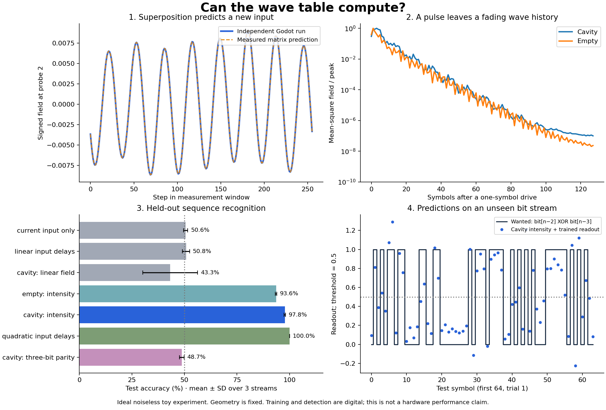

# From wave patterns to computation

The first two experiments work with the **same Godot wave solver as the table**.
They turn a visual sandbox into a small, reproducible computation benchmark.
These first experiments run from the command line. The newer
[Pulse lab experiments](pulse_experiments.md) add native Godot controls, fitting,
replay and export for pulse timing and an eight-mode cavity with threshold nodes.
That lab uses a separate reduced model; the matrix and delayed-XOR results below
continue to use the editable table's scalar wave solver.

## What happened

On Godot 4.4.1, with the fixed geometries in `capture.gd`:

| Experiment | Result | What this establishes |
| --- | --- | --- |
| Two sources, three probes: calibrate a complex matrix, then drive three new input vectors | Maximum relative output error about 1.26 × 10⁻⁷ | The measured field transformation predicts simultaneous inputs |
| Read delayed XOR from an open cavity's intensity pattern | **97.8%** mean test accuracy | Propagation/interference history plus square-law detection can support a nonlinear temporal task |
| Same task, empty table | **93.6%** | Some useful history already comes from propagation; mirrors are not essential for this task |
| Current input only / linear electronic input delays | **50.6% / 50.8%** | Those fitted readouts do not solve the task |
| Electronic input delays with the required quadratic product | **100%** | This is a computing primitive demonstration, not an advantage over software |
| Three-bit parity, same cavity intensity features | **48.7%** | The present feature map and trained readout have a clear limit |

Accuracy is averaged over three independent stream trials, each with 1,000 test
symbols. The cavity XOR runs were 98.1%, 97.5%, and 97.7%. Geometry, timing and
probe placement were selected before evaluation and were not tuned on these
results. This is an ideal noiseless scalar model; no hardware claim follows.



All scores, including the unsuccessful linear-field readouts, seeds, chosen
regularization values, measured matrix and checks are in
[`results/summary.json`](results/summary.json).

## Reproduce

From the project root, using Godot 4.4+ and Python 3.10+:

```sh
godot --headless --path . --editor --quit
godot --headless --path . --script research/capture.gd
python -m pip install -r research/requirements.txt
python research/analyze.py research/raw.json --out research/results
```

Use your Godot executable's full path if `godot` is not on PATH. The first script
captures actual native solver fields into `research/raw.json`. The second fits
the readouts and writes the figure and result JSON. The raw capture is ignored
by Git because it is reproducible and relatively large. Python dependencies are
only needed for this optional research workflow; opening the table still needs
only Godot. Runtime depends on CPU speed.

## Why a wave table is already a matrix

Numbers can be encoded in coherent field amplitudes. A phase shift of half a
cycle represents a sign reversal. For a fixed linear optical system, every
source contributes to every output:

\[
E_j = \sum_i H_{ji} x_i, \qquad \mathbf E = H\mathbf x.
\]

Each coefficient describes how much of source i reaches probe j, including its
phase. Splitting, propagation, attenuation and recombination implement these
weighted sums. Nothing needs to count individual photons to do the arithmetic.

For intuition, an ideal lossless two-port mixer can implement, with suitable
port phase conventions:

\[
\begin{bmatrix}y_1\\y_2\end{bmatrix}
=\frac{1}{\sqrt 2}
\begin{bmatrix}1&1\\1&-1\end{bmatrix}
\begin{bmatrix}x_1\\x_2\end{bmatrix}.
\]

Equal in-phase inputs leave through one port; reversing one input's phase sends
them through the other. Total power is conserved. A dark port means energy was
redistributed, not destroyed. An ordinary detector measures |E|², so phase-aware
or balanced detection is needed when the answer must retain a sign or phase.

Our calibration uses a 64 × 48 grid, two point sources in the same green band,
a glass slab, and three probes. The optical period is exactly 32 steps. After
advancing through the source startup ramp with zero drive, each fresh run has
256 settling steps and 256 measurement steps. Sine/cosine projection extracts a
complex output coefficient. Two basis runs supply the matrix columns. Three
additional native runs check signed input combinations.

The measured matrix is a **fixed finite-window input/output map**, not a
converged steady-state scattering matrix. We have calibrated the matrix the
geometry happens to implement; programming a requested arbitrary matrix is a
separate inverse-design problem. In real coherent processors, meshes of beam
splitters and phase shifters implement unitary transformations; attenuation
and scaling extend them to more general matrices. Passive optics cannot supply
arbitrary gain. See [Shen et al., coherent nanophotonic circuits](https://arxiv.org/abs/1610.02365).

Adding the intensities of separately driven sources gives the wrong prediction:
it discards interference cross terms. In these three checks that incorrect
method has 34–79% relative error, despite the accurate field prediction.

## Why a passive reservoir can do something nonlinear

The wave equation remains linear. The field at a probe contains differently
delayed contributions from earlier inputs. Squaring that field creates products:

\[
(a x+b y)^2 = a^2x^2+b^2y^2+2abxy.
\]

For binary inputs, XOR is x + y − 2xy. A collection of intensity measurements
can expose combinations from which a signed electronic weighted sum recovers
this relation. The reservoir supplies a feature map and memory; training adjusts
only the output weights. It does not change the wave equation or train each
point in the field as an independent neuron.

This distinction is studied explicitly in
[Pauwels et al., distributed Kerr nonlinearity in a coherent reservoir](https://www.frontiersin.org/journals/physics/articles/10.3389/fphy.2019.00138/full):
nonlinearity can enter at input, inside the medium, or at detection. Our current
experiment uses detection, with no nonlinear optical material or feedback.

### Protocol and controls

- A bit selects source amplitude 0 or 1 for one 32-step optical cycle. The target
  after symbol n is `bit[n-2] XOR bit[n-3]`; the delay allows propagation time.
- Twenty-four probes each measure mean-square field over the current symbol.
  **The UI's exponentially averaged intensity is not used.** The detector
  does not retain a separate history across symbols.
- The cavity is open on the left, bounded by three mirrors, with the default
  absorbing outer sponge. The control removes the mirrors and keeps the probes.
- For efficiency, Godot measures a 128-symbol response to a one-symbol drive.
  Python convolves this measured response with each input stream. This is valid
  because propagation is linear and symbols share a carrier phase. A separate
  192-symbol native run checks the shortcut, including beyond the captured
  history length. The JSON records field and intensity errors and the response
  tail. This shortcut would not apply after adding nonlinear material dynamics.
  Applying the first trained readout to the 64 post-washout symbols of that
  separate native run gives 96.9% accuracy, with identical binary decisions to
  the convolution shortcut. This short check verifies the pipeline; the larger
  three-stream evaluation supplies the headline result.
- Each trial uses independent train, validation and test streams, reset initial
  conditions, and a 128-symbol washout. Counts after washout are 1,200 / 500 /
  1,000. Feature scaling and ridge fitting use training data only. Validation
  selects the regularization; test labels do not affect fitting or selection.
- The linear-field comparison uses sine/cosine projections of the same field.
  Its test accuracy varies substantially and does not reliably recover XOR.
  The quadratic electronic baseline explicitly includes the relevant delayed
  product, so it is a sufficiency control, not a competitive hardware benchmark.
- Three-bit parity is a separate negative-control target. Linear propagation
  plus intensity gives quadratic features of the input history; that does not
  give an exact representation of general higher-order functions. Failure of
  this particular readout is not a universal impossibility result for optics.

No noise, detector bandwidth model beyond within-symbol averaging, device
fabrication errors, power budget or speed comparison is included. More seeds,
signal-to-noise sweeps, larger-grid convergence and an electromagnetic solver
would be needed for stronger scientific or device-design conclusions.

## A photonic neuron to try next

A useful first neuron is a **weighted coherent sum, detector, and an electronic
nonlinear response that drives the next optical input**. Its physical and digital
parts can be shown separately. A sigmoid drawn over a linear wave visualization
does not create nonlinear wave dynamics.

For a neuron whose internal optical dynamics change with its state, a next model
could be a driven Kerr resonator. One simplified complex-envelope equation is

\[
\dot a = [-\kappa/2+i(\Delta+\chi|a|^2)]a+\sqrt{\kappa_e}\,u(t).
\]

Here a is stored field amplitude, kappa sets leakage, Delta is detuning and chi
sets an intensity-dependent resonance shift. Setting chi to zero provides a
linear control. Nonzero chi can produce nonlinear response and, in appropriate
parameter regimes, bistability. This would be a new model requiring validation,
not an interpretation we can apply to the current linear solver. Spiking or
laser neurons generally need additional gain/carrier dynamics.

The especially close spatial inspiration is
[Sunada and Uchida's microcavity-wave reservoir](https://arxiv.org/abs/1907.12396).
They numerically model a nonlinear gain medium with coupled field, polarization
and population variables. That is a plausible later direction for the pool-table
idea. It is substantially richer than the passive scalar waves implemented here.

## The next visible experiment

Build a research bench around **input → waves → probes → prediction**:

1. **Add and subtract light.** Two input amplitude/phase controls; display signed
   output and intensity together. Predict cancellation, then reveal the result.
2. **Make an echo lock.** Feed a bit stream, show its target delayed XOR, and
   learn the readout. Drag a mirror or move a probe and compare validation error.
3. **Find a useful geometry.** Try fewer probes, shorter decision latency or
   tolerance to phase noise. Score unseen streams with frozen readout weights.
4. **Recognize something.** Progress to pulse-order recognition, noisy waveform
   classification, or inferring a material's refractive index from its response.
   Compare against a simple digital baseline at each stage.

The possible game is designing an optical instrument under constraints. Its
feedback is an error trace and a successful prediction, not merely a bright
target. Keep a validation stream available while building; reserve fresh seeds
for final tests so repeated play does not turn test data into training data.

For now the research question is concrete: **which geometries create useful,
robust input-history features, for which tasks, and at what measurement cost?**
