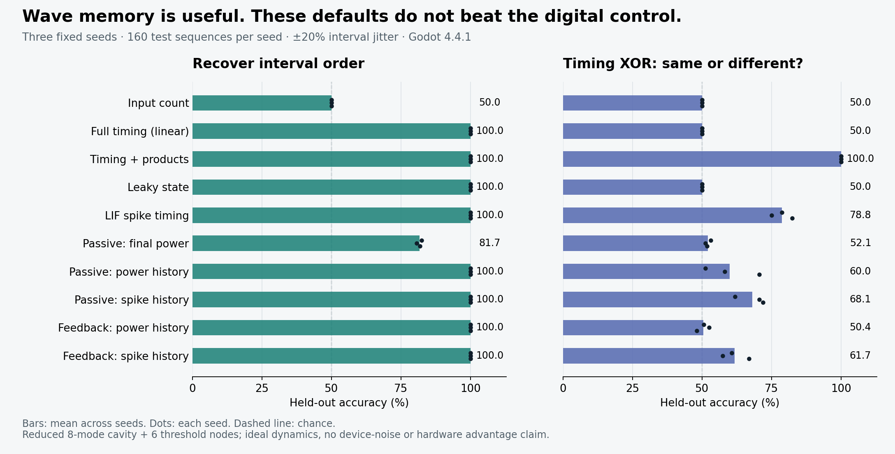

# Pulse timing, waves and spikes

Open the project in Godot 4.4+, press F5, then **Pulse lab**. Everything in this
lab—including dataset generation and fitting—runs in native Godot. Python is
only needed to regenerate the summary figure.

## Three experiments

1. **A neuron that prefers a rhythm.** Compare a leaky integrator with a damped
   complex resonator. Both receive two equal kicks, have decay time 1.8 fundamental
   periods, and fire at state 1.4. Set the pulse gap to **0.5**, then **1.0**.
   The resonator fires for the wider gap: the second kick arrives in phase with
   the remaining state. The integrator fires for both. Disable threshold/reset
   to inspect the underlying continuous responses.
2. **Remember interval order.** Four equal input kicks arrive with interval order
   1–2–3 or 3–2–1. Both classes have the same pulse count, duration and interval
   multiset. Each matched pair shares the same randomly perturbed intervals.
   Watch the field, six probe powers and six emitted-spike rasters, then train
   the readouts to recover the order.
3. **Timing XOR.** The first and last intervals independently encode short (0.8)
   or long (1.6). Predict whether their categories differ. The middle interval
   adjusts so each sequence still lasts six periods. Unlike the order task,
   interval multisets are not matched between classes. This asks the readout to
   combine two earlier events rather than identify one gap.

Each sequence begins at t = 0.4 and ends at 6.4; observations stop at 7.6.
Replay preserves the exact input. **Try a new sequence** draws new jitter from
a separate example seed, keeping the selected class. The frozen readouts predict
from the *completed* sequence; displayed predictions are not online forecasts.

Change decay, aspect ratio, threshold, recovery, feedback, jitter or dataset seed
to invalidate the previous fit. Changes to dynamics preserve the displayed input
sequence for direct comparison; changing task, jitter or seed draws a new one.
At high jitter the nominal middle and long intervals can exchange length; labels
refer to their nominal order. **Run comparison** always evaluates passive and
feedback variants. The feedback checkbox only selects which one is displayed.
Export saves parameters, exact commanded input times, features, labels, trained
scaling/weights, held-out predictions, and the current example's partial or full
trace. The export records how far playback reached. Scores are unbounded linear
outputs, not calibrated probabilities.

## What is actually simulated?

This lab uses a **new reduced modal model**, separate from the original editable
finite-difference wave table. It approximates a rectangular cavity with eight
analytic standing-wave modes and six optoelectronic threshold nodes. It does
not solve a laser's gain/carrier equations or a nonlinear Maxwell–Bloch system.

The field is reconstructed from complex mode amplitudes:

\[
E(x,y,t)=\tfrac12\sum_{m,n}a_{mn}(t)\sin(m\pi x)\sin(n\pi y),\qquad
\dot a_{mn}=(-1/\tau+i\omega_{mn})a_{mn}.
\]

The mode pairs are (1,1), (2,1), (1,2), (3,1), (2,2), (1,3), (3,2), (2,3).
Frequencies are proportional to √((m/aspect)²+n²), normalized to fundamental
period T₀ = 1. Source and feedback ports couple through their mode values with
unit L2 normalization. Fields are zero at the four walls. Eight modes cannot
represent sharp local wavefronts; this model is useful for modal memory and
interference, not propagation-time or diffraction accuracy.

Each probe measures p = |E|². A leaky state q approaches 12p with time constant
0.25. At q ≥ threshold it emits a spike, resets q to zero and clamps it there
for its recovery period. In feedback mode a firing node injects a coherent
modal kick at its probe. That kick is **supplied by an external pump**. This is
an abstract optoelectronic feedback loop, not spontaneous optical gain or an
energy-conserving passive component. Input kick amplitude is fixed; it is not
a calibrated pulse energy, since an additive coherent drive can exchange
different energies with different existing states.

All modes propagate by exact damped rotations at fixed dt = 0.025. Input events
round **up** to the next dt boundary (with a 1e−9 numerical comparison tolerance).
Probe power and thresholds are evaluated after the input kick; simultaneous
feedback kicks follow those measurements. Threshold crossing and recovery are
therefore time-discretized. The pair experiment uses dt = 0.005. Times and powers
are dimensionless; these are not optical seconds or watts. Mode amplitudes use
Godot Vector2 precision; regression uses double precision arrays. A numerical
run stops as unstable if a mode is nonfinite or its squared magnitude exceeds
10,000; amplitudes are not silently clipped.

The **passive field remains linear**. Square-law measurement supplies a
nonlinear feature map. Threshold/reset supplies another nonlinearity, and
feedback lets emitted events change future fields. Turning feedback off does
not turn off square-law detection or probe spike generation.

## Fair comparisons and their limits

Each seed has 160 training, 80 validation and 160 test examples. Every example
starts from a zero state. These are episodic sequence-recognition experiments,
not a continuous-stream memory-capacity benchmark. Split random seeds are
seed, seed+104729 and seed+209759. Examples are generated in balanced matched
pairs (order) or balanced groups of four (XOR); related examples stay in the
same split. Counts must be positive multiples of four.

The default jitter is independent uniform ±20% of each nominal interval.
Order-task intervals are then normalized to sum to six. For XOR, the first
and last gaps receive independent jitter and the middle fills the remainder.
The UI restricts jitter to 30%, keeping short and long ranges distinct.

| Readout | Features | Information supplied |
| --- | ---: | --- |
| Input count | 1 | Number of input pulses |
| Full timing (linear) | 3 | All three commanded input intervals |
| Timing + products | 6 | Those intervals and their three pairwise products |
| Leaky state | 6 | Final states of six non-resetting exponential input traces |
| LIF spike timing | 48 | Eight time bins of spikes from six input-driven leaky integrate-and-fire nodes |
| Passive: final power | 6 | Probe power at the decision time |
| Passive / feedback: power history | 48 | Six probes × eight within-bin mean powers |
| Passive / feedback: spike history | 48 | Same probes and time bins, with emitted spike counts |

The leaky controls have decay times τ×(0.55+0.24j), j = 0…5. Their spiking
versions fire/reset at 1.4; these controls have no separate refractory period.
The three timing features use exact commanded times, whereas dynamical models
receive events quantized to dt. Thus the timing baseline has finer input timing
precision; it deliberately establishes what is recoverable from the input.

All rows fit a linear ridge readout. Training data alone determines feature
means/scales and weights. Validation MSE selects regularization from
0.001, 0.01, 0.1, 1.0; test labels only score the selected readout. Classification
uses score > 0.5+1e−8, treating a constant 0.5 fit as class zero rather than
classifying floating-point noise. The class balance then gives exactly 50%.

The power/spike-history rows have equal feature counts, **not equal information
precision, measurement bandwidth, energy, or hardware cost**. Analog means and
integer counts are different measurement channels. A full output-spike train
may contain information lost by eight-bin sampling. The input itself already
contains the relevant information; waves can transform it into useful features,
not create additional information about the target.

Repeatedly changing settings against the same test seed turns it into a
development set. Use fresh seeds for a final comparison. We do not model phase
noise, detector noise, fabrication variation or wall-clock hardware throughput.
Changing decay also changes the matching leaky controls; changing aspect changes
relative modal frequencies while the fundamental period stays normalized.

## First measured results

Fixed defaults, seeds **42, 101, 2026**, Godot 4.4.1. Entries below are means
across three independently generated test sets, each containing 160 examples.
Seeds measure input sampling variation; cavity geometry is fixed. The paired
examples are statistically dependent within each pair/group, so 480 examples
should not be treated as 480 independent Bernoulli trials for confidence bounds.



Order recognition is solved by full timing, leaky states, LIF spikes and both
history readouts. The passive final-power snapshot averages 81.7%. Retaining
history helps this particular readout, but the task does not demonstrate a
special advantage for a cavity.

Timing XOR is a useful negative result: explicit digital products reach 100%,
LIF spike timing averages 78.8%, passive spike history 68.1%, passive power
history 60.0%, feedback spike history 61.7% and feedback power history 50.4%.
Input count, linear timing and the non-resetting leaky-state readout score 50%.
These defaults do **not** demonstrate that continuous wave readouts outperform
spikes, or that feedback improves calculation. The experiment makes that claim
testable rather than assuming it from an attractive field animation.

The order task was tried first; after it proved easy, XOR was added as a separate
harder task. No cavity parameters were optimized on the reported full runs.
The measured result files include per-seed scores, confusion matrices, exact
sequences, labels, weights and all test predictions:
[order](results/pulse-order.json), [XOR](results/pulse-xor.json).

## Reproduce and extend

```sh
godot --headless --path . --editor --quit
godot --headless --path . --script tests/test_pulse.gd
godot --headless --path . -- --pulse-smoke
godot --headless --path . --script research/run_pulse_study.gd -- --output=research/results/pulse-order.json
godot --headless --path . --script research/run_pulse_study.gd -- --xor --output=research/results/pulse-xor.json
python research/plot_pulse_study.py
```

`--quick` uses one seed and 40/20/40 examples. The GUI runs one chosen seed with
the full split sizes; the command-line default runs the three listed seeds.
The full study is a few seconds per seed on the development machine; interactive
collection is spread across frames so cancellation remains responsive.

Next experiments should preselect development seeds, sweep decay and jitter,
then compare frozen choices on fresh seeds. A useful extension is a streaming
task with a decision deadline and matched measurement budgets. A nonlinear
optical medium would require a distinct model and convergence checks.

Research inspiration:

- [Maass, Natschläger and Markram (2002)](https://pubmed.ncbi.nlm.nih.gov/12433288/):
  liquid-state computing connects spike inputs to evolving dynamical states.
- [Adair et al. (2026)](https://www.nature.com/articles/s42005-026-02694-5):
  photonic–electronic resonate-and-fire dynamics motivate interval selectivity;
  the toy resonator here is not a reproduction of their device.
- [Sunada and Uchida (2019)](https://arxiv.org/abs/1907.12396): nonlinear
  microcavity-wave reservoirs motivate spatial readout, but their numerical
  Maxwell–Bloch model includes medium dynamics absent here.
- [Pauwels et al. (2019)](https://www.frontiersin.org/journals/physics/articles/10.3389/fphy.2019.00138/full):
  distinguishes nonlinearities in encoding, propagation and detection.
